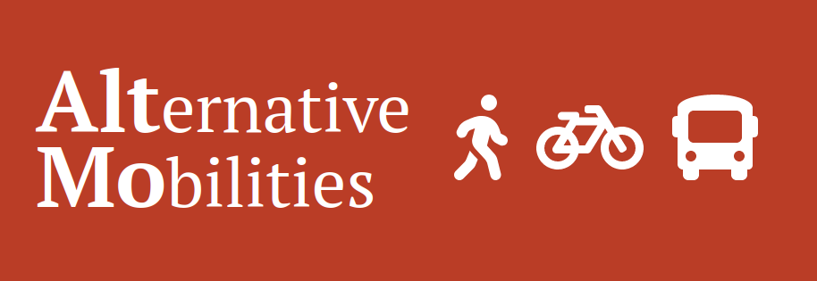

Welcome to AltMo
==========================================================

This is a project which provides a way to generate a walkability or bikeability composite index
for an area of interest. It relies on primarily on Open Street Map data to do this.

.. toctree::
   :maxdepth: 1
   :caption: Contents:

   tutorials/basic
